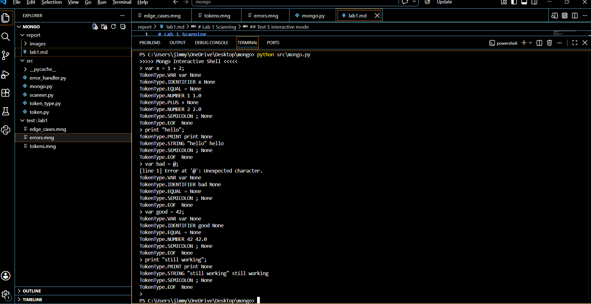

# Lab 1 Scanning
Name: Mongo
File extension: .mng
Written in Python

## Regular Expressions

Number literals
\d+(\.\d+)?

String literals
"[^"]*"

Identifiers
[a-zA-Z_][a-zA-Z_0-9]*

## Design Choices

I took the books design from chapter 4 pretty much did exactly what it did but 
in Python instead of Java. Only thing I changed is the I named it Mongo and used the
file extension .mng after the pet in Dungeon Crawler Carl. is called Mongo and source 
files end in .mng instead of Lox and .lox.

put errors in src/error_handler.py like you said to in the slides. 

added the line for errors, and pass the linee and what caused it. 

## Files

src/mongo.py          entry point 
src/scanner.py        the scanner 
src/token.py          token class 
src/token_type.py     the enum of token types
src/error_handler.py  error and report

## Setup

Nothing to install. Just Python.

## Running
ran it from the root folder Mongo on my computer where I have all the files saved.

Interactive mode
python src\mongo.py

Source file mode
python src\mongo.py test\lab1\tokens.mng

Usage message
PS C:\Users\jimmy\OneDrive\Desktop\mongo> python src\mongo.py 123.mng 456.mng
Usage: python src/mongo.py [script.mng]

this is what i used to test if everything was working 
python src\mongo.py test\lab1\tokens.mng
python src\mongo.py test\lab1\edge_cases.mng
python src\mongo.py test\lab1\errors.mng
python src\mongo.py a.mng b.mng

Exit codes are same as book. 0 is fine and 64 is bad command line and 65 means there was
a lexical error.

## Output Format

Every token prints as type, lexeme, literal value. Literal is None for
everything except STRING and NUMBER.

## Test 1 tokens.mng
testing all the tokens 

Code:
( ) { } , . - + ; / *
! != = == > >= < <=
and class else false fun for if nil or print return super this true var while
istartwithaletter _lookmomiamanunderscore dskjfdsLKJLKJ564564
0 42 3.14
"hello" "" "42"

Line 1 is the single character tokens. Line 2 is the one and two character
operators. Line 3 is all 16 reserved words. Line 4 is three identifiers, one
starting with a letter, one starting with an underscore, one with caps and
numbers in it. Line 5 is zero, a multi digit number, and a decimal. Line 6 is a
normal string, an empty string, and digits inside a string so they come back
STRING and not NUMBER.

Expected: one token per thing in order and EOF at the end with no errors.

Actual

## Test 2 edge_cases.mng

tried to thing of the cases from class where it might error

Code:
order iffyx classact andworhol former
_ _123464654 _sdfsd dsfd123
.456
123.
! = < >
a / b
// line comment with no tokens
c // trail comment
"a string
of a string that is really stringy"
space	tab	plus	more
// comment at end of file with no newline

Line 1 is maximal munch. used a few reserved words with extra stuff. 

Line 2 is underscore identifiers.

Line 3 and 4 are dot cases.

Line 5 is the single character operators by themselves so they dont get read as
the two char versions .

Line 6 is a slash that is division and not a comment.

Lines 7 and 8 are comments, one on its own line and one trailing after code.

Lines 9 and 10 are one string on two lines.

Line 11 is tabs between identifiers.

Line 12 is a comment at the very end of the file with no newline after it.

Expected: no errors.

## Test 3 errors.mng

this one is for some bad input and both of the lexical errors

Code:
var b = a @ 2;
var e = "NoEndQuots

added some bad input and then didnt end a quote to get the Unexpected char and the 
unterminated string errors

Expected: two errors

## Test 4 command line usage

more than one argument should print the usage line instead of trying to
run something.

Source input
python src\mongo.py a.mng b.mng

Expected: the usage line

## Test 5 interactive mode

the REPL reads one line at a time and works after an error.

what I typed in the prompttyped at the prompt
python src\mongo.py

var x = 1 + 2; then hit enter
print "hello"; then hit enter
var bad = @; then hit enter
var good = 42; then hit enter
print "still working"; then hit enter
finished with Ctrl C to exit. 

Line 3 throws the unexpected character error. Lines 4 and 5 scanning fine to show
 it recovered ctrl c to finish.

Actual

